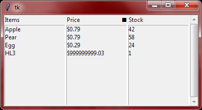

# multiframe_list.py
Compact raw python module that brings the MultiframeList class with it.
It is a tkinter widget that can be used to display data split up over multiple columns.
It integrates into the ttk styling database and applies certain style configurations to
otherwise unstylable Listboxes.

## Installation
Get it by running `pip install multiframe_list`

## Example script:

```python
import tkinter as tk
from multiframe_list import MultiframeList

def format_price(raw):
    dollars, cents = divmod(raw, 100)
    return f"${dollars}.{cents:0>2}"

items = (
    ("Apple", 79, 42),
    ("Pear", 79, 58),
    ("Egg", 29, 24),
    ("HL3", 99999999903, 1),
)

root = tk.Tk()

item_display = MultiframeList(root, inicolumns = (
    {"name": "Items", "col_id": "col_items", "sort": False},
    {"name": "Price", "col_id": "col_prices", "sort": True,
	 "formatter": format_price},
    {"name": "Stock", "col_id": "col_qty", "sort": False},
))

item_display.setdata({
    "col_items":  [t[0] for t in items],
    "col_prices": [t[1] for t in items],
    "col_qty":    [t[2] for t in items],
})
item_display.format()
# Required for the price formatter or that column would display raw values

item_display.grid(sticky = "nesw")
root.mainloop()
```
Will result in this window:

  

## Documentation

Most information can be found in the docstrings of the MultiframeList's class and its methods.  
Other than that:
```
 ~ ### ~ ~
   *#*       
 /  s  \

             ___              _
            /  -]  /|         |
___n____m_-_|___|__||_____---_|__
.             _          .       
   .-.    ~         ___       ' .     
 n_|:|       .    '           __ 
 '-. |_n      _         _______   . 
   | .-'                     __.      
  _|:|___  *             -  [__/     
   | |         ~   ===         
    *  ___     .      - ---
```